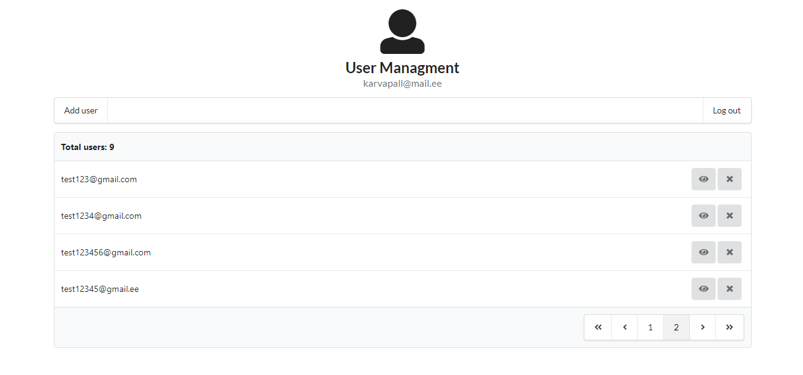

# User managment tool

Enables to register a user and log in. E-mail verification process and password recovery have not been implemented.
Authenticated user can add and delete users. It's also possible to check last login times (if present) of any user.

## Setup

`git clone https://github.com/tuhnik/user-managment.git && cd user-managment && npm install`

## NPM Scripts

`npm run client` runs front-end.

`npm run server` runs back-end.

`npm run both` runs back-end and front-end.

`npm run build` builds front-end.

## Screenshot

## Live demo
[janar.me/user-managment](https://janar.me/user-managment/)

## API documentation
`GET` /api or [README.md](https://github.com/tuhnik/user-managment/blob/master/server/README.md)
